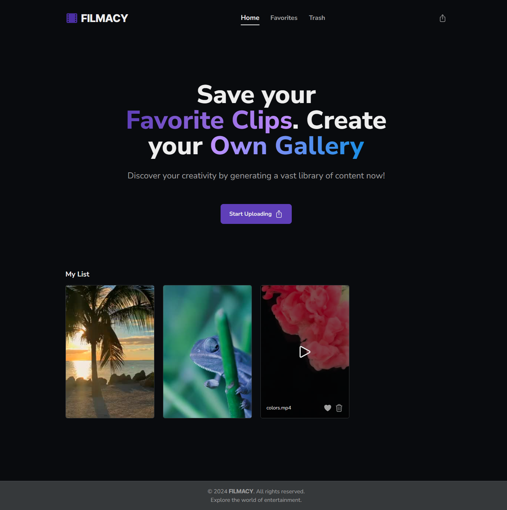

# Filmacy (video streaming)🍿🎬

## Description

This project is a personal learning endeavor where I've applied my knowledge of Vue.js, Pinia, and Tailwind CSS. It's a fully responsive local video streaming platform that allows users to upload videos from their computer, view a list of uploaded videos, mark favorites, and delete videos as needed.

**Note**: The primary learning scope of this project is the frontend. Therefore, the backend does not adhere to best practices in folder organization and structure.

## Project Structure

The project is divided into two main directories:

- `client`: Contains all the frontend code, built with Vue.js and styled using Tailwind CSS🎨.
- `api`: Houses the backend code, which manages video uploads, storage, and other server-side operations⚙️.

## Features

- **Video Upload**: Easily upload video files from your computer to the platform.
- **Thumbnail Generation**: Use a frame of the it as a thumbnail to display a video card.
- **Video List**: Browse through a list of all uploaded videos.
- **Video Player**: Play your videos by streaming them from the backend.
- **Favorites**: Mark videos as favorites for quick access.
- **Video Management**: Delete videos that are no longer needed.

## Getting Started

To get the project up and running on your local machine, follow these steps:

### Prerequisites

- Node.js >= 18 installed
- `ffmpeg` installed in any folder of your machine (since is used to generate the thumbnail)

### Installation

1. Clone the repository to your local machine.
2. Navigate to the `client` directory and install the dependencies:

```bash
cd client
npm install
```

3. Start the client development server:

```bash
npm run dev
```

4. In a separate terminal, navigate to the api directory and install the dependencies:

```bash
cd api
npm install
```

5. Start the development server:

```bash
npm run dev
```

<br />

Now, the platform should be running on your local environment, and you can begin streaming videos!

<br />


